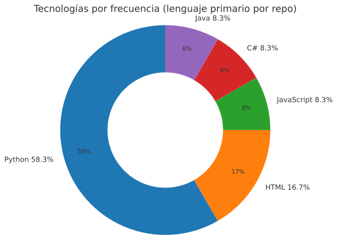

<!-- Perfil Especializado de GitHub -->

<h1 align="center">👋 ¡Hola, soy Marcos Avila</h1>
<h3 align="center">Estudiante de Ingeniería en Sistemas de Computación | Desarrollador Full-Stack 🚀</h3>

---

## 📊 Tecnologías por frecuencia (repositorios)

  

| Lenguaje    | Repos | % |
|-------------|------:|--:|
| Python      | 7     | 58% |
| HTML        | 2     | 17% |
| JavaScript  | 1     | 8%  |
| C#          | 1     | 8%  |
| Java        | 1     | 8%  |

*Fuente: lenguaje primario visible en la pestaña **Repositories** de GitHub (18-ago-2025).* 

---

## 🛠️ Tecnologías y Herramientas

<!-- Lenguajes -->

 

<!-- Frameworks -->

 

<!-- Bases de datos y otros -->

 

<!-- Librerías / ORMs -->

 

<!-- Otros (metodologías/servicios) -->

---
<!-- 
## 📌 Proyectos Destacados
| Proyecto | Descripción | Tecnologías |
|----------|-------------|-------------|
| 🎮 **E-commerce Gaming** | Tienda en línea con temática de videojuegos | React, Node.js, MongoDB |
| 🔐 **Sistema de Control de Acceso** | Gestión de usuarios con autenticación JWT | Flask, SQLAlchemy, Docker |
| 🌍 **App de Geolocalización** | Mapas interactivos y rutas en tiempo real | React Native, APIs de Google Maps |
| 📊 **Dashboard de Estadísticas** | Visualización de datos en tiempo real | .NET, Chart.js, PostgreSQL |

---
-->

## 📫 Cómo contactarme

---

## 🌱 Actualmente aprendiendo
- **APIs seguras** con JWT y OAuth2  
- **Data Science & Machine Learning**
- **Software architecture**

---

## ⚡ Fun facts
- 🔭 Me gusta automatizar tareas con **Python + Bash**  
- 🕹️ Gamer apasionado y creador de proyectos relacionados a videojuegos  
- 🎯 Mi meta es convertirme en **Arquitecto de Software / DevOps**  

---

✨ ¡Gracias por visitar mi perfil! ✨

